代码模式从用户输入到执行完成的完整流程：

```mermaid
graph TD
    A["用户在聊天界面输入任务"] --> B["ChatView 组件处理输入"]
    B --> C["解析 @mentions 和上下文"]
    C --> D["发送 postMessage 到 ClineProvider"]
    
    D --> E["ClineProvider 接收消息"]
    E --> F["调用 initClineWithTask()"]
    F --> G["获取当前模式配置"]
    
    G --> H["从 modes.ts 加载代码模式配置"]
    H --> I["代码模式配置:<br/>- roleDefinition: '高技能软件工程师'<br/>- groups: ['read', 'edit', 'browser', 'command', 'mcp']"]
    
    I --> J["生成系统提示"]
    J --> K["调用 getCapabilitiesSection()"]
    K --> L["根据工具组生成工具描述"]
    L --> M["组装完整的系统提示"]
    
    M --> N["发送到 AI 提供商"]
    N --> O["AI 开始处理任务"]
    
    O --> P["AI 分析任务并选择工具"]
    P --> Q["工具权限验证"]
    Q --> R{工具是否被允许?}
    
    R -->|是| S["执行工具调用"]
    R -->|否| T["返回权限错误"]
    
    S --> U["工具执行结果"]
    U --> V["更新 UI 状态"]
    V --> W["显示进度给用户"]
    
    W --> X{任务是否完成?}
    X -->|否| P
    X -->|是| Y["使用 attempt_completion 工具"]
    Y --> Z["向用户展示最终结果"]
    
    subgraph "工具执行详情"
        S1["read_file - 读取文件"]
        S2["write_to_file - 写入文件"]
        S3["execute_command - 执行命令"]
        S4["browser_action - 浏览器操作"]
        S5["MCP 工具 - 外部工具"]
        S --> S1
        S --> S2
        S --> S3
        S --> S4
        S --> S5
    end
```



## 关键代码组件

代码模式的配置定义在 `src/shared/modes.ts` 中， [1](#4-0) 它拥有所有工具组的完整访问权限。<cite/>

系统提示生成通过多个函数协作完成，包括能力描述生成， [2](#4-1) 确保AI了解其可用的工具和能力。<cite/>

## Notes

这个流程图展示了代码模式从用户输入到任务完成的完整生命周期。代码模式的核心特点是拥有最全面的工具权限，使其能够执行读取、编辑、命令执行、浏览器控制和MCP工具等所有操作，适合处理各种编程任务。

Wiki pages you might want to explore:
- [Overview (RooVetGit/Roo-Code)](/wiki/RooVetGit/Roo-Code#1)
- [Mode and Tool Management UI (RooVetGit/Roo-Code)](/wiki/RooVetGit/Roo-Code#3.3)
- [Internationalization and Localization (RooVetGit/Roo-Code)](/wiki/RooVetGit/Roo-Code#6)

### Citations

**File:** src/shared/modes.ts (L77-86)
```typescript
	{
		slug: "code",
		name: "💻 Code",
		roleDefinition:
			"You are Roo, a highly skilled software engineer with extensive knowledge in many programming languages, frameworks, design patterns, and best practices.",
		whenToUse:
			"Use this mode when you need to write, modify, or refactor code. Ideal for implementing features, fixing bugs, creating new files, or making code improvements across any programming language or framework.",
		description: "Write, modify, and refactor code",
		groups: ["read", "edit", "browser", "command", "mcp"],
	},
```

**File:** src/core/prompts/__tests__/__snapshots__/add-custom-instructions/ask-mode-prompt.snap (L294-300)
```text

- You have access to tools that let you execute CLI commands on the user's computer, list files, view source code definitions, regex search, read and write files, and ask follow-up questions. These tools help you effectively accomplish a wide range of tasks, such as writing code, making edits or improvements to existing files, understanding the current state of a project, performing system operations, and much more.
- When the user initially gives you a task, a recursive list of all filepaths in the current workspace directory ('/test/path') will be included in environment_details. This provides an overview of the project's file structure, offering key insights into the project from directory/file names (how developers conceptualize and organize their code) and file extensions (the language used). This can also guide decision-making on which files to explore further. If you need to further explore directories such as outside the current workspace directory, you can use the list_files tool. If you pass 'true' for the recursive parameter, it will list files recursively. Otherwise, it will list files at the top level, which is better suited for generic directories where you don't necessarily need the nes ... (truncated)
- You can use search_files to perform regex searches across files in a specified directory, outputting context-rich results that include surrounding lines. This is particularly useful for understanding code patterns, finding specific implementations, or identifying areas that need refactoring.
- You can use the list_code_definition_names tool to get an overview of source code definitions for all files at the top level of a specified directory. This can be particularly useful when you need to understand the broader context and relationships between certain parts of the code. You may need to call this tool multiple times to understand various parts of the codebase related to the task.
    - For example, when asked to make edits or improvements you might analyze the file structure in the initial environment_details to get an overview of the project, then use list_code_definition_names to get further insight using source code definitions for files located in relevant directories, then read_file to examine the contents of relevant files, analyze the code and suggest improvements or make necessary edits, then use the write_to_file tool to apply the changes. If you refactored code that could affect other parts of the codebase, you could use search_files to ensure you update other files as needed.
- You can use the execute_command tool to run commands on the user's computer whenever you feel it can help accomplish the user's task. When you need to execute a CLI command, you must provide a clear explanation of what the command does. Prefer to execute complex CLI commands over creating executable scripts, since they are more flexible and easier to run. Interactive and long-running commands are allowed, since the commands are run in the user's VSCode terminal. The user may keep commands running in the background and you will be kept updated on their status along the way. Each command you execute is run in a new terminal instance.
```