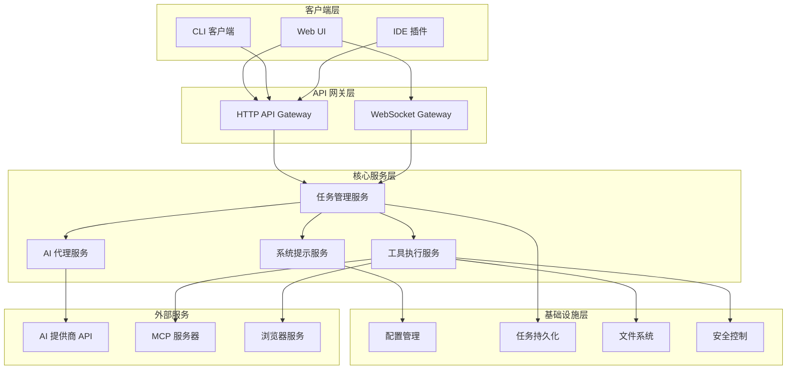
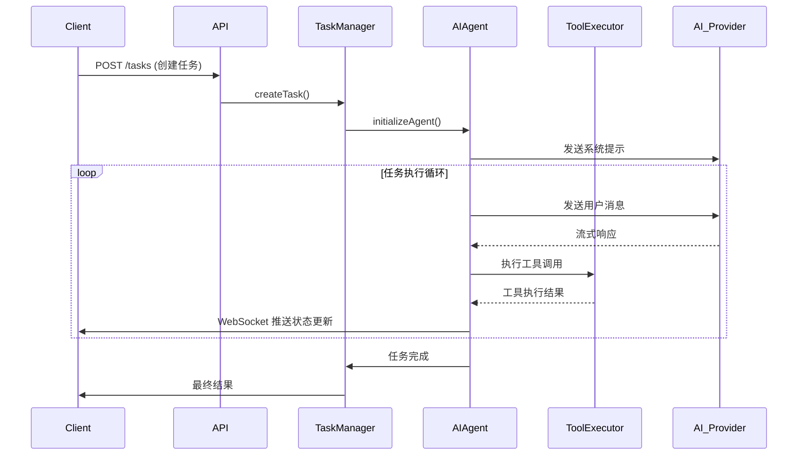

# Roo-Code 后端服务架构设计

## 概述

本文档描述了将 roo-code 的代码模式功能提取为独立后端服务的架构设计。该服务将提供完整的 AI 编程助手能力，支持文件操作、命令执行、浏览器控制等功能。

## 整体架构



## 核心模块设计

### 1. 任务管理服务 (TaskManager)

**职责：**
- 任务生命周期管理
- 任务状态跟踪
- 任务队列管理
- 并发控制

**核心类：**
```typescript
class TaskManager {
  private tasks: Map<string, Task>
  private taskQueue: TaskQueue
  
  async createTask(request: CreateTaskRequest): Promise<Task>
  async getTask(taskId: string): Promise<Task | null>
  async pauseTask(taskId: string): Promise<void>
  async resumeTask(taskId: string): Promise<void>
  async abortTask(taskId: string): Promise<void>
  async listTasks(filter?: TaskFilter): Promise<Task[]>
}
```

### 2. 工具执行服务 (ToolExecutor)

**职责：**
- 工具调用路由
- 权限验证
- 执行结果处理
- 错误处理和重试

**支持的工具组：**
- **read**: `read_file`, `list_files`, `search_files`, `list_code_definition_names`
- **edit**: `write_to_file`, `str_replace_editor`, `apply_diff`
- **command**: `execute_command`, `terminal_session`
- **browser**: `browser_action`, `screenshot`
- **mcp**: 外部 MCP 工具集成

### 3. AI 代理服务 (AIAgent)

**职责：**
- AI 提供商集成
- 流式响应处理
- 上下文管理
- 对话历史维护

**支持的 AI 提供商：**
- Anthropic Claude
- OpenAI GPT
- Google Gemini
- 本地模型 (Ollama)

### 4. 系统提示服务 (PromptService)

**职责：**
- 动态生成系统提示
- 模式配置管理
- 能力描述生成
- 上下文信息注入

## 数据流设计

### 任务执行流程



## API 接口设计

### RESTful API

#### 任务管理
```http
POST /api/v1/tasks
GET /api/v1/tasks
GET /api/v1/tasks/{taskId}
PUT /api/v1/tasks/{taskId}/pause
PUT /api/v1/tasks/{taskId}/resume
DELETE /api/v1/tasks/{taskId}
```

#### 配置管理
```http
GET /api/v1/config
PUT /api/v1/config
GET /api/v1/config/providers
PUT /api/v1/config/providers/{providerId}
```

### WebSocket API

#### 实时任务状态
```typescript
interface TaskStatusUpdate {
  taskId: string
  status: 'running' | 'paused' | 'completed' | 'failed'
  progress?: number
  message?: string
  toolCall?: ToolCall
  result?: any
}
```

## 配置系统

### 配置文件结构
```yaml
# config.yaml
server:
  port: 3000
  host: "0.0.0.0"
  cors:
    enabled: true
    origins: ["*"]

ai_providers:
  anthropic:
    api_key: "${ANTHROPIC_API_KEY}"
    base_url: "https://api.anthropic.com"
    models:
      - "claude-3-5-sonnet-20241022"
      - "claude-3-5-haiku-20241022"
  
  openai:
    api_key: "${OPENAI_API_KEY}"
    base_url: "https://api.openai.com/v1"
    models:
      - "gpt-4o"
      - "gpt-4o-mini"

security:
  allowed_commands:
    - "npm"
    - "git"
    - "python"
    - "node"
  denied_commands:
    - "rm -rf"
    - "sudo"
  
  file_access:
    allowed_paths:
      - "/workspace"
      - "/tmp"
    denied_paths:
      - "/etc"
      - "/root"

storage:
  type: "file" # file | redis | mongodb
  path: "./data"
  
logging:
  level: "info"
  format: "json"
```

## 安全机制

### 1. 命令执行安全
- 命令白名单/黑名单
- 执行超时控制
- 资源使用限制
- 沙箱环境支持

### 2. 文件访问控制
- 路径白名单/黑名单
- 文件权限检查
- 敏感文件保护
- 文件大小限制

### 3. API 安全
- JWT 认证
- 速率限制
- CORS 配置
- 请求验证

## 部署方案

### Docker 部署
```dockerfile
FROM node:18-alpine

WORKDIR /app

COPY package*.json ./
RUN npm ci --only=production

COPY . .

EXPOSE 3000

CMD ["npm", "start"]
```

### Docker Compose
```yaml
version: '3.8'

services:
  micro-butler-backend:
    build: .
    ports:
      - "3000:3000"
    environment:
      - NODE_ENV=production
      - ANTHROPIC_API_KEY=${ANTHROPIC_API_KEY}
      - OPENAI_API_KEY=${OPENAI_API_KEY}
    volumes:
      - ./workspace:/workspace
      - ./data:/app/data
    restart: unless-stopped
  
  redis:
    image: redis:7-alpine
    ports:
      - "6379:6379"
    volumes:
      - redis_data:/data
    restart: unless-stopped

volumes:
  redis_data:
```

## 技术栈

### 后端框架
- **Node.js + TypeScript**: 主要开发语言
- **Fastify**: 高性能 Web 框架
- **Socket.IO**: WebSocket 实现
- **Zod**: 数据验证

### 数据存储
- **SQLite**: 轻量级关系数据库
- **Redis**: 缓存和会话存储
- **文件系统**: 任务数据持久化

### 工具和库
- **Puppeteer**: 浏览器控制
- **node-pty**: 终端会话管理
- **chokidar**: 文件系统监控
- **winston**: 日志管理

## 性能优化

### 1. 并发处理
- 任务队列管理
- 工作线程池
- 异步 I/O 优化

### 2. 缓存策略
- 系统提示缓存
- 文件内容缓存
- API 响应缓存

### 3. 资源管理
- 内存使用监控
- 连接池管理
- 垃圾回收优化

## 监控和日志

### 1. 应用监控
- 任务执行状态
- API 响应时间
- 错误率统计
- 资源使用情况

### 2. 日志管理
- 结构化日志
- 日志级别控制
- 日志轮转
- 远程日志收集

## 扩展性设计

### 1. 插件系统
- 自定义工具插件
- AI 提供商插件
- 存储后端插件

### 2. 微服务架构
- 服务拆分策略
- 服务发现
- 负载均衡
- 容错处理

## 迁移计划

### 阶段 1: 核心功能提取 (2-3 周)
1. 提取 Task 类和相关依赖
2. 重构工具系统
3. 实现基础 API 接口

### 阶段 2: 服务化改造 (2-3 周)
1. 实现 HTTP API 服务
2. 添加 WebSocket 支持
3. 配置管理系统

### 阶段 3: 完善和优化 (2-3 周)
1. 安全机制实现
2. 性能优化
3. 监控和日志

### 阶段 4: 测试和部署 (1-2 周)
1. 集成测试
2. 性能测试
3. 生产环境部署

## 风险评估

### 技术风险
- VS Code 扩展依赖解耦复杂度
- 工具执行安全性
- 并发任务管理复杂性

### 业务风险
- 功能完整性保证
- 性能要求满足
- 用户体验一致性

### 缓解措施
- 渐进式迁移
- 充分测试
- 回滚方案准备